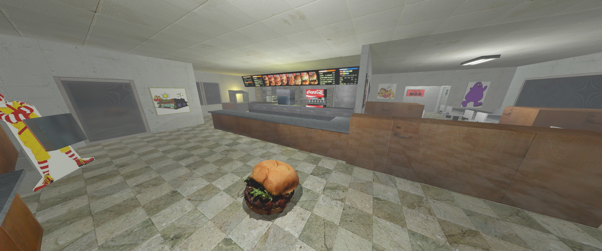

# Engine

</img>

An unnamed, almost-entirely from-scratch, engine written in C++.

## Build

While the build system is fairly barebones and robust under `make`, dependency tracking is not.
* Ensure all requested dependencies under `REQ_DEPS` are available in your build system, as well as a valid compiler under `CC`/`CXX`.

Configuration for build targets are available under `./makefiles/` are available with the naming convention `${system}.${compiler}.make`.
* Additional compiler flags and `make` variables can be specified here.

To compile, run `make`. The outputted libraries and executables will be placed in the right folders under `./bin/`.

## Run

Currently, assets are not provided due to size (but mostly due to being test assets).

*If* adequate assets are provided, run `./program.sh` or `make run`. This ensures the path to the required libraries are added to the PATH.

## Documentation

The provided documentation under [./docs/](./docs/) should (eventually) provide thorough coverage over most, if not all, of this project.